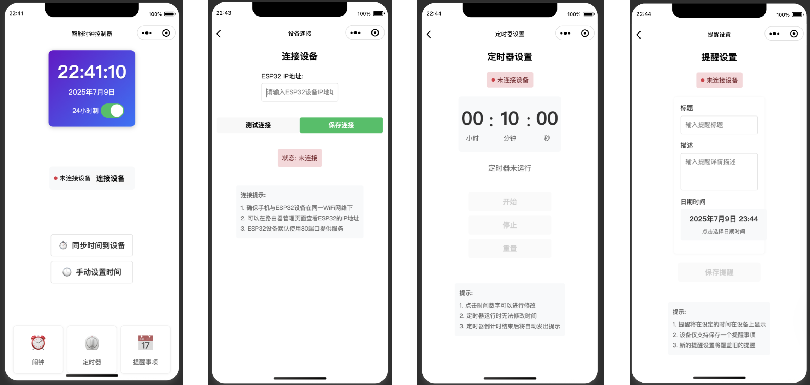

# ESP32 智能桌面助手 - 微信小程序

本项目是“ESP32智能桌面助手”的微信小程序客户端，用于通过本地Wi-Fi网络连接、控制和监控ESP32设备。



## ✨ 功能列表

- **设备连接**: 通过输入IP地址，快速连接到局域网内的ESP32设备。
- **状态显示**:
  - 实时显示ESP32上的当前时间、日期。
  - 显示设备连接状态和IP地址。
- **时间管理**:
  - **同步时间**: 一键将手机的当前时间同步到ESP32设备。
  - **手动设置**: 通过日期和时间选择器，手动设置ESP32的日期和时间。
  - **格式切换**: 切换设备上的时间显示为12小时制或24小时制。
- **核心功能**:
  - **闹钟设置**: 远程设置和管理设备的闹钟。
  - **定时器**: 控制设备的定时器功能，包括开始、暂停和重置。
  - **提醒事项**: 创建和管理发送到设备的提醒。

## 🚀 如何使用

1.  **准备工作**:
    - 确保您的ESP32设备已经成功连接到Wi-Fi网络。
    - 确保您的手机与ESP32设备连接在 **同一个** Wi-Fi网络下。
    - 获取ESP32设备的IP地址。

2.  **导入项目**:
    - 克隆或下载此项目。
    - 打开“微信开发者工具”。
    - 选择“导入项目”，并选择本项目的根目录 (`miniprogram-1`)。
    - AppID可以点击“测试号”自动生成一个。

3.  **配置开发环境**:
    - 在微信开发者工具的右上角，点击“详情” -> “本地设置”。
    - 勾选“不校验合法域名、web-view（业务域名）、TLS 版本以及 HTTPS 证书”选项，以便在开发环境下进行局域网HTTP通信。

4.  **连接设备**:
    - 运行小程序，在首页点击“连接设备”按钮。
    - 在连接页面输入您的ESP32设备的IP地址，然后点击“连接”。
    - 连接成功后，页面会自动返回首页，并显示“已连接”状态。

5.  **开始使用**:
    - 连接成功后，您可以在首页上使用所有功能，如同步时间、设置闹钟等。

## 🛠️ 开发说明

### 项目结构

```
miniprogram-1/
├── miniprogram/
│   ├── pages/          # 小程序所有页面
│   │   ├── index/      # 首页（主控制台）
│   │   ├── connect/    # 连接设备页面
│   │   └── ...         # 其他功能页面
│   ├── utils/
│   │   ├── api.ts      # 封装与ESP32通信的API
│   │   └── util.ts     # 工具函数
│   ├── app.ts          # 小程序主逻辑
│   ├── app.json        # 全局配置文件
│   └── app.wxss        # 全局样式
└── project.config.json # 项目配置文件
```

### API 通信

- 所有与ESP32设备的HTTP通信都封装在 `miniprogram/utils/api.ts` 文件中。
- `ESP32Api` 类提供了所有API的调用方法（如 `getStatus`, `setTime` 等）。
- 在使用API前，必须先通过 `setIpAddress` 方法设置ESP32的IP地址。

### 状态同步

由于ESP32不支持WebSocket等主动推送技术，本小程序采用 **“操作后刷新”** 和 **“定时轮询”** 结合的策略来同步UI和设备状态。

- **操作后刷新**: 在用户完成一项设置（如设置闹钟、切换时间格式）后，会立即调用 `fetchDeviceStatus` 方法获取最新状态，确保UI实时更新。
- **定时轮询**（可选实现）: 对于需要持续更新的数据（如倒计时），可以通过 `setInterval` 定时调用 `fetchDeviceStatus` 实现。

### 添加新功能

1.  在 `miniprogram/pages/` 目录下创建新的页面。
2.  如果需要新的API，请在 `miniprogram/utils/api.ts` 中添加新的请求方法。
3.  在对应的页面 `ts` 文件中，引入 `espApi` 并调用相应的方法。
4.  完成页面 `wxml` 和 `wxss` 的布局与样式。

## 📝 API 概览

小程序通过以下API与ESP32设备进行通信。

- `GET /api/status`: 获取设备所有状态（时间、闹钟、定时器等）。
- `POST /api/time`: 设置设备时间。
- `POST /api/time_format`: 设置12/24小时制。
- `POST /api/alarm`: 设置闹钟。
- `POST /api/timer`: 控制定时器。
- `POST /api/reminder`: 设置提醒事项。

详细的API请求和响应格式请参考 [说明文档](./说明文档.md)